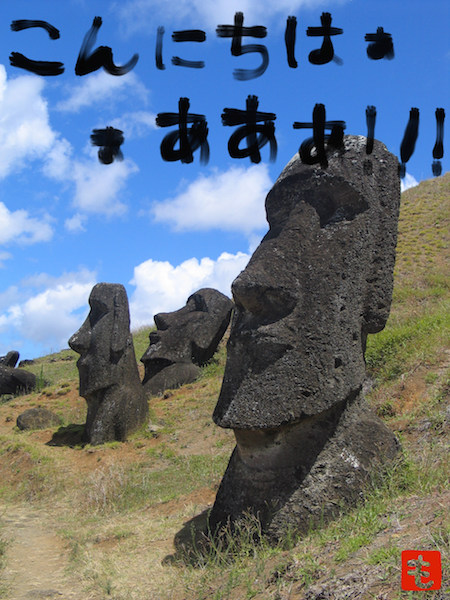

# moaimoai-okinawa.github.io 

## その1：メンバー登録しますので、メルアドorアカウント名を西島に教えて下さい。

これも自動でできるといいな。

## その2：疑問に思ってること、課題と思ってること、助けてほしいこと、議論したいことなどについて、Issueを立てましょう。

[https://github.com/moaimoai-okinawa/moaimoai-okinawa.github.io](https://github.com/moaimoai-okinawa/moaimoai-okinawa.github.io)

## その3：Webサイトは作ってないので、気が向いたら作る予定。もしくはだれかWIPでプルリク立てて、作ってくれてもOKです〜！

このリポジトリ自体がWebサイトのリポジトリになります。

## その4：共有すべき知見やファイル、テンプレなどは別途リポジトリを立てて共有していきましょう〜。

